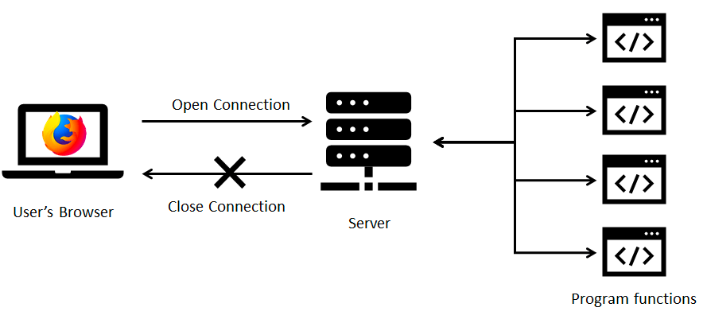
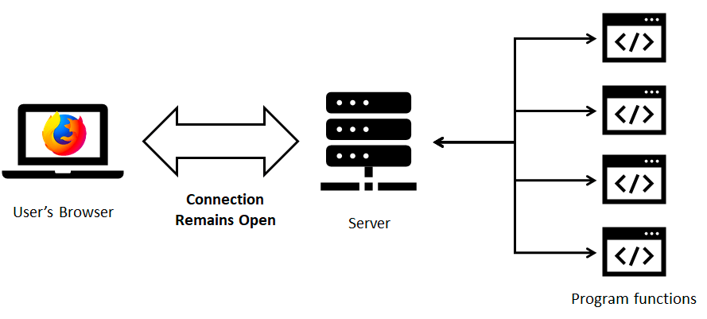
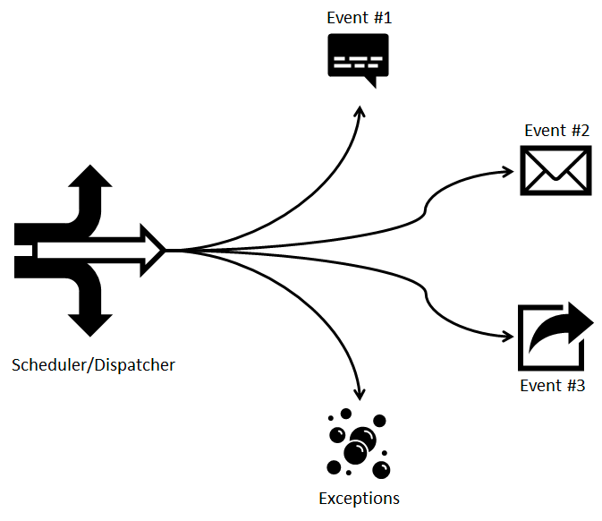

= Event-Driven Programming

== 이벤트 기반 프로그래밍
* **이벤트 기반 프로그래밍(Event-Driven Programming)**은 런타임 구성 요소가 이벤트를 열고, 이벤트에 응답하는 소프트웨어 애플리케이션을 구축하기 위한 아키텍처 설계 패턴

_전통적인 프로그래밍_

* 우리가 많이 사용하는 HTTP 프로토콜은 전통적인 프로그래밍 방식으로 동작
* 브라우저에서 다른 응답이 필요한 경우 새 요청을 열고 응답을 받아야 함.

_이벤트 기반 프로그래밍_
]
* 지속적으로 연결된 상태에서 이벤트를 주고 받는 방식으로 동작

== 이벤트 기반 프로그래밍 작동 방식

* 이벤트 객체(Event Object) : 이벤트를 식별할 수 있는 정보를 묶은 것
* 이벤트 소스(Event Source) : 이벤트가 발생하는 개체로 발생한 이벤트에 대한 정보를 핸들러에게 제공할 책임이 있음.
* 이벤트 리스너(Event Listener) : 이벤트에 대한 응답을 생성하는 역할을 수행함. 이벤트 핸들러(Event Handler)라고도 함.